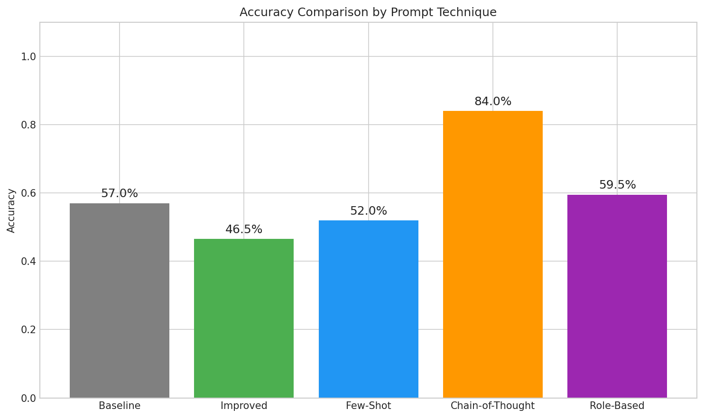
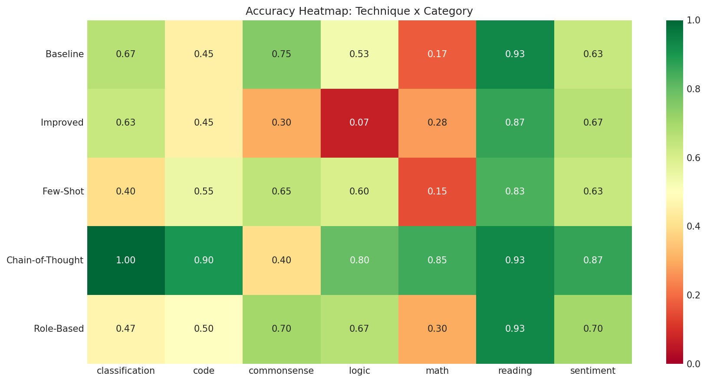
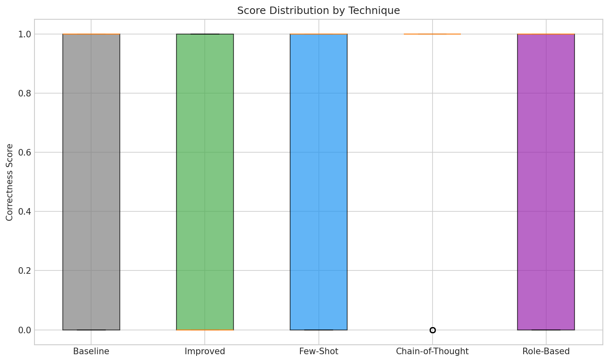

# Project 6: Prompt Engineering Research

[](https://github.com/YOUR_USERNAME/LLMCourseProject/actions/workflows/ci.yml)
[](https://codecov.io/gh/YOUR_USERNAME/LLMCourseProject)
[](https://www.python.org/downloads/)

A research project measuring how different prompt engineering techniques affect LLM performance at scale. Tests baseline, improved prompts, few-shot learning, chain-of-thought, and role-based prompting across 100 test cases with 7 categories and 3 difficulty levels.

## Overview

This project investigates the effectiveness of various prompt engineering techniques for mass production use cases where consistency (low variance) matters as much as accuracy.

### Prompt Techniques Tested

| Technique | Description |
|-----------|-------------|
| **Baseline** | Minimal prompt with no special techniques |
| **Improved** | Structured format with category-specific hints |
| **Few-Shot** | Includes 3 examples before the question |
| **Chain-of-Thought** | Step-by-step reasoning instructions |
| **Role-Based** | Expert persona assignment |

### Test Categories

- Sentiment Analysis (15 cases)
- Multi-step Math (20 cases)
- Logical Reasoning (15 cases)
- Text Classification (15 cases)
- Reading Comprehension (15 cases)
- Common Sense Reasoning (10 cases)
- Code Output Prediction (10 cases)

## Example Results

The following results were obtained using `llama3.2:3b` on 100 test cases (2 runs each = 200 responses per technique):

| Technique | Accuracy | Variance | Change vs Baseline |
|-----------|----------|----------|-------------------|
| **Baseline** | 57.0% | 0.245 | — |
| **Improved** | 46.5% | 0.249 | -18.4% |
| **Few-Shot** | 52.0% | 0.250 | -8.8% |
| **Chain-of-Thought** | **84.0%** | **0.134** | **+47.4%** |
| **Role-Based** | 59.5% | 0.241 | +4.4% |

**Key Finding:** Chain-of-Thought prompting achieved the best results with 84% accuracy and the lowest variance (0.134), making it the most suitable technique for mass production scenarios.

### Performance by Category (Chain-of-Thought)

| Category | Accuracy |
|----------|----------|
| Classification | 100% |
| Reading | 93.3% |
| Code | 90.0% |
| Sentiment | 86.7% |
| Math | 85.0% |
| Logic | 80.0% |
| Commonsense | 40.0% |

### Sample Visualizations

The project generates 8 publication-quality visualizations. Here are key results:

#### Accuracy Comparison by Technique


*Bar chart comparing overall accuracy across all 5 prompt techniques. Chain-of-Thought clearly outperforms others.*

#### Performance Heatmap (Technique × Category)


*Heatmap showing accuracy breakdown by technique and category. Darker colors indicate higher accuracy.*

#### Consistency Analysis (Variance)


*Box plot showing score variance for each technique. Lower variance indicates more consistent, production-suitable results.*

## Architecture

### System Overview

```
┌─────────────────────────────────────────────────────────────────┐
│                        CLI Runner Scripts                        │
│  run_baseline.py | run_cot.py | run_few_shot.py | ...           │
└─────────────────────────────────┬───────────────────────────────┘
                                  │
                                  ▼
┌─────────────────────────────────────────────────────────────────┐
│                      src/cli_runner.py                          │
│            Shared experiment orchestration logic                 │
└─────────────────────────────────┬───────────────────────────────┘
                                  │
          ┌───────────────────────┼───────────────────────┐
          ▼                       ▼                       ▼
┌──────────────────┐  ┌──────────────────┐  ┌──────────────────┐
│  Config          │  │ ExperimentRunner │  │ MetricsCalculator│
│  (config.py)     │  │ (experiment_     │  │ (metrics.py)     │
│                  │  │  runner.py)      │  │                  │
│ - ollama_host    │  │ - load test cases│  │ - accuracy       │
│ - model_name     │  │ - run techniques │  │ - variance       │
│ - runs_per_case  │  │ - collect results│  │ - aggregations   │
└──────────────────┘  └────────┬─────────┘  └──────────────────┘
                               │
          ┌────────────────────┼────────────────────┐
          ▼                    ▼                    ▼
┌──────────────────┐  ┌──────────────────┐  ┌──────────────────┐
│  OllamaClient    │  │ PromptGenerators │  │ AnswerEvaluator  │
│  (ollama_        │  │ (src/prompts/)   │  │ (answer_         │
│   client.py)     │  │                  │  │  evaluator.py)   │
│                  │  │ - Baseline       │  │                  │
│ - generate()     │  │ - Improved       │  │ - exact match    │
│ - list_models()  │  │ - FewShot        │  │ - contains match │
│                  │  │ - CoT            │  │ - numeric match  │
│                  │  │ - RoleBased      │  │                  │
└────────┬─────────┘  └──────────────────┘  └──────────────────┘
         │
         ▼
┌──────────────────┐
│   Ollama API     │
│ (localhost:11434)│
└──────────────────┘
```

### Data Flow

1. **Test Cases** (`data/test_cases.csv`) → 100 questions across 7 categories
2. **Prompt Generator** → Transforms question into technique-specific prompt
3. **Ollama Client** → Sends prompt to local LLM, receives response
4. **Answer Evaluator** → Compares response to expected answer
5. **Metrics Calculator** → Aggregates results into statistics
6. **Results** → CSV files + JSON stats saved to `results/`

### Key Components

| Component | File | Purpose |
|-----------|------|---------|
| Config | `src/config.py` | Load settings from environment |
| OllamaClient | `src/ollama_client.py` | HTTP client for Ollama API |
| ExperimentRunner | `src/experiment_runner.py` | Orchestrate test execution |
| PromptGenerators | `src/prompts/*.py` | Generate technique-specific prompts |
| AnswerEvaluator | `src/answer_evaluator.py` | Evaluate response correctness |
| MetricsCalculator | `src/metrics.py` | Calculate accuracy, variance, etc. |
| Visualization | `src/visualization.py` | Generate comparison charts |

## Installation

### Prerequisites

- Python 3.9 or higher
- Ollama (local LLM runtime)

### Installing Ollama

Ollama is a tool for running large language models locally. Follow the instructions for your operating system:

#### Windows

1. Download the installer from [ollama.com/download](https://ollama.com/download)
2. Run the installer and follow the prompts
3. After installation, Ollama will run as a background service
4. Open a terminal and pull the model:
   ```powershell
   ollama pull llama3.2:3b
   ```

#### macOS

1. Download from [ollama.com/download](https://ollama.com/download) or use Homebrew:
   ```bash
   brew install ollama
   ```
2. Start Ollama:
   ```bash
   ollama serve
   ```
3. In another terminal, pull the model:
   ```bash
   ollama pull llama3.2:3b
   ```

#### Linux

1. Install using the official script:
   ```bash
   curl -fsSL https://ollama.com/install.sh | sh
   ```
2. Start Ollama:
   ```bash
   ollama serve
   ```
3. In another terminal, pull the model:
   ```bash
   ollama pull llama3.2:3b
   ```

#### WSL (Windows Subsystem for Linux)

If running Python in WSL but Ollama on Windows:

1. Install Ollama on Windows (see Windows instructions above)
2. Find your Windows host IP:
   ```bash
   # In WSL, run:
   cat /etc/resolv.conf | grep nameserver | awk '{print $2}'
   ```
3. Set the host in your `.env` file:
   ```bash
   OLLAMA_HOST=http://<windows-ip>:11434
   ```

### Verifying Ollama Installation

```bash
# Check if Ollama is running
curl http://localhost:11434/api/tags

# List available models
ollama list

# Test the model
ollama run llama3.2:3b "Hello, how are you?"
```

### Project Setup

1. Clone the repository:
```bash
git clone <repository-url>
cd project6-prompt-engineering-research
```

2. Create a virtual environment:
```bash
python -m venv .venv
source .venv/bin/activate  # On Windows: .venv\Scripts\activate
```

3. Install dependencies:
```bash
pip install -r requirements.txt
# Or with dev dependencies:
pip install -e ".[dev]"
```

4. Configure environment variables (optional):
```bash
cp .env.example .env
# Edit .env to customize OLLAMA_HOST or MODEL_NAME if needed
```

## Usage

### Quick Start

```bash
# 1. Ensure Ollama is running with the model
ollama serve                    # Start Ollama (if not already running)
ollama pull llama3.2:3b         # Download the model

# 2. Run a single experiment
python run_baseline.py          # ~15-30 minutes for 200 API calls

# 3. Or run all experiments
python run_all_techniques.py    # ~2-3 hours for all 5 techniques

# 4. Generate visualizations
python generate_figures.py      # Creates 8 PNG charts in results/figures/
```

### Running Individual Experiments

Each experiment can be run independently:

```bash
python run_baseline.py          # Minimal prompts (control group)
python run_improved.py          # Structured prompts with hints
python run_few_shot.py          # 3-shot learning examples
python run_cot.py               # Chain-of-thought reasoning
python run_role_based.py        # Expert persona prompts
```

Each script will:
- Load 100 test cases from `data/test_cases.csv`
- Run each case 2 times (configurable) to measure consistency
- Save results to `results/<technique>_results.csv`
- Generate statistics in `results/<technique>_stats.json`

### Configuration Options

Set these in `.env` or as environment variables:

| Variable | Default | Description |
|----------|---------|-------------|
| `OLLAMA_HOST` | `http://localhost:11434` | Ollama server URL |
| `MODEL_NAME` | `llama3.2:3b` | Model to use for experiments |

### Applying Manual Overrides

If you need to manually correct answer evaluations:

1. Edit `data/manual_overrides.csv` with your corrections:
   ```csv
   technique,case_id,run,correct
   baseline,42,1,True
   cot,15,2,False
   ```
2. Run the override script:
   ```bash
   python apply_overrides.py baseline    # Apply to one technique
   python apply_overrides.py             # Apply to all techniques
   ```

### Programmatic Usage

```python
from src import Config, ExperimentRunner, OllamaClient
from src.prompts import ChainOfThoughtPromptGenerator

# Load configuration
config = Config.from_env()

# Initialize client and runner
client = OllamaClient(config)
runner = ExperimentRunner(config, client=client)

# Run a single technique
generator = ChainOfThoughtPromptGenerator()
results_df = runner.run_technique("cot", generator.generate)

# Access results
print(f"Accuracy: {results_df['correct'].mean():.2%}")
```

### Generating Visualizations

```bash
# Generate all 8 figures
python generate_figures.py
```

This creates the following charts in `results/figures/`:
- `accuracy_by_technique.png` - Bar chart comparing techniques
- `improvement_bars.png` - Improvement % vs baseline
- `accuracy_heatmap.png` - Accuracy by technique × category
- `difficulty_heatmap.png` - Accuracy by technique × difficulty
- `variance_boxplot.png` - Consistency comparison
- `radar_comparison.png` - Multi-dimensional comparison
- `difficulty_trend.png` - Performance across difficulty levels
- `score_histograms.png` - Score distributions

### Running Tests

```bash
# Run all tests
pytest tests/

# Run with coverage
pytest --cov=src --cov-report=html

# Run specific test file
pytest tests/test_config.py -v
```

## Project Structure

```
project6-prompt-engineering-research/
├── .env.example              # Environment variables template
├── pyproject.toml            # Project configuration
├── README.md                 # This file
├── CLAUDE.md                 # Claude Code project guidance
├── CONTRIBUTING.md           # Contribution guidelines
├── COSTS.md                  # Cost analysis (local = $0)
├── PROMPT_BOOK.md            # PRPs used with Claude Code
│
├── run_baseline.py           # Run baseline experiment
├── run_improved.py           # Run improved prompt experiment
├── run_few_shot.py           # Run few-shot experiment
├── run_cot.py                # Run chain-of-thought experiment
├── run_role_based.py         # Run role-based experiment
├── run_all_techniques.py     # Run all experiments sequentially
├── apply_overrides.py        # Apply manual answer corrections
├── generate_figures.py       # Generate visualization charts
│
├── data/
│   ├── test_cases.csv        # 100 test cases (7 categories, 3 difficulties)
│   └── manual_overrides.csv  # Manual answer corrections
│
├── src/                      # Core Python package
│   ├── __init__.py           # Package exports
│   ├── config.py             # Configuration (Ollama host, model name)
│   ├── ollama_client.py      # Ollama API client wrapper
│   ├── answer_evaluator.py   # Response evaluation logic
│   ├── answer_utils.py       # Answer extraction utilities
│   ├── metrics.py            # Statistics calculation
│   ├── experiment_runner.py  # Experiment orchestration
│   ├── cli_runner.py         # Shared CLI runner for experiments
│   ├── comparison_utils.py   # Cross-technique comparison
│   ├── override_utils.py     # Manual override utilities
│   ├── visualization.py      # Visualization coordinator
│   │
│   ├── prompts/              # Prompt generators
│   │   ├── __init__.py
│   │   ├── base.py           # BaselinePromptGenerator
│   │   ├── improved.py       # ImprovedPromptGenerator
│   │   ├── few_shot.py       # FewShotPromptGenerator
│   │   ├── chain_of_thought.py # ChainOfThoughtPromptGenerator
│   │   └── role_based.py     # RoleBasedPromptGenerator
│   │
│   └── charts/               # Chart generation modules
│       ├── __init__.py
│       ├── base.py           # Base chart class
│       ├── bar_charts.py     # Bar chart generators
│       ├── heatmaps.py       # Heatmap generators
│       ├── line_charts.py    # Line chart generators
│       └── specialized_charts.py  # Radar, histograms, etc.
│
├── tests/                    # Unit tests
│   ├── test_config.py
│   ├── test_metrics.py
│   ├── test_answer_evaluator.py
│   ├── test_prompts.py
│   └── test_prompts_advanced.py
│
├── results/                  # Output directory
│   ├── *_results.csv         # Raw results per technique
│   ├── *_stats.json          # Statistics per technique
│   ├── comparison_stats.json # Cross-technique comparison
│   └── figures/              # Generated visualizations (8 PNG files)
│
├── report/
│   └── REPORT.md             # Full analysis report with embedded figures
│
├── docs/                     # Documentation
│   ├── PRD.md                # Product requirements
│   ├── ARCHITECTURE.md       # System design
│   ├── stage-1-2-instructions.md  # Dataset & baseline instructions
│   ├── stage-3-instructions.md    # Prompt techniques instructions
│   └── stage-4-instructions.md    # Visualization instructions
│
└── PRPs/                     # Prompt Request Plans (for Claude Code)
    ├── 00-project-overview.md
    ├── 01-stage-1-dataset.md
    ├── 02-stage-2-baseline.md
    ├── 03-stage-3-techniques.md
    └── 04-stage-4-analysis.md
```

## Key Metrics

- **Accuracy**: Proportion of correct answers
- **Mean**: Average correctness score
- **Variance**: Score spread (lower = more consistent)
- **Improvement %**: Change relative to baseline

## Troubleshooting

### Ollama Connection Issues

```bash
# Check if Ollama is running
curl http://localhost:11434/api/tags

# If not running, start it:
ollama serve
```

### Model Not Found

```bash
# Pull the required model
ollama pull llama3.2:3b

# List available models
ollama list
```

### WSL Network Issues

If running in WSL and can't connect to Ollama on Windows:
1. Ensure Windows Firewall allows connections on port 11434
2. Use the Windows host IP instead of localhost
3. Check that Ollama is configured to listen on all interfaces

## 📄 License

Academic Research Project
**Institution**: Reichman University, IL

## 👥 Authors

**Niv Ben Salmon** & **Omer Ben Salmon**
MSc Computer Science Students
Reichman University, Israel
