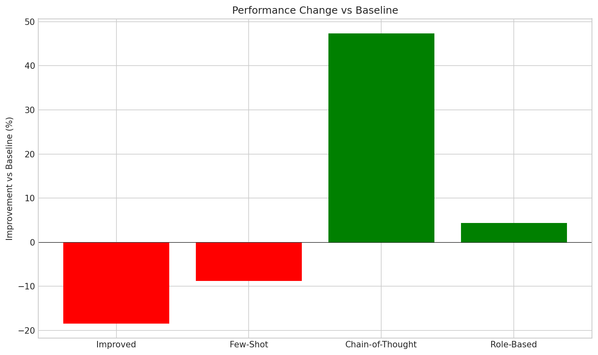
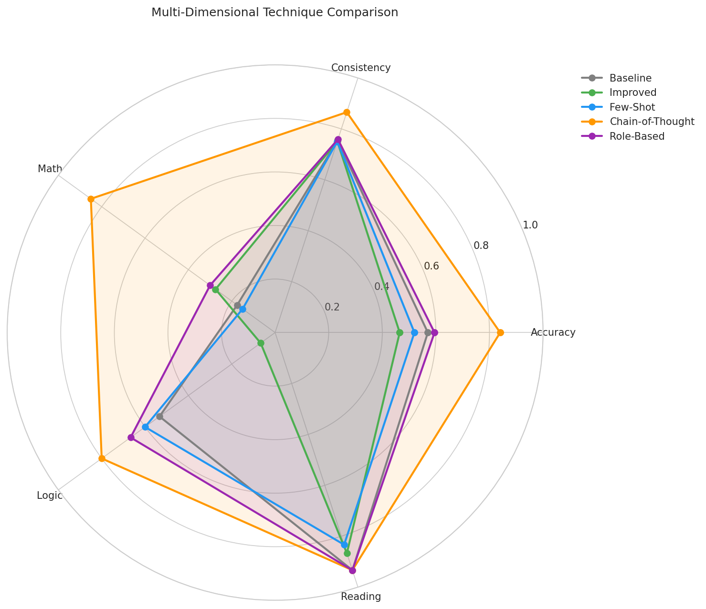
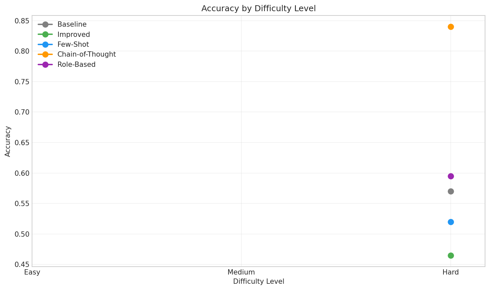
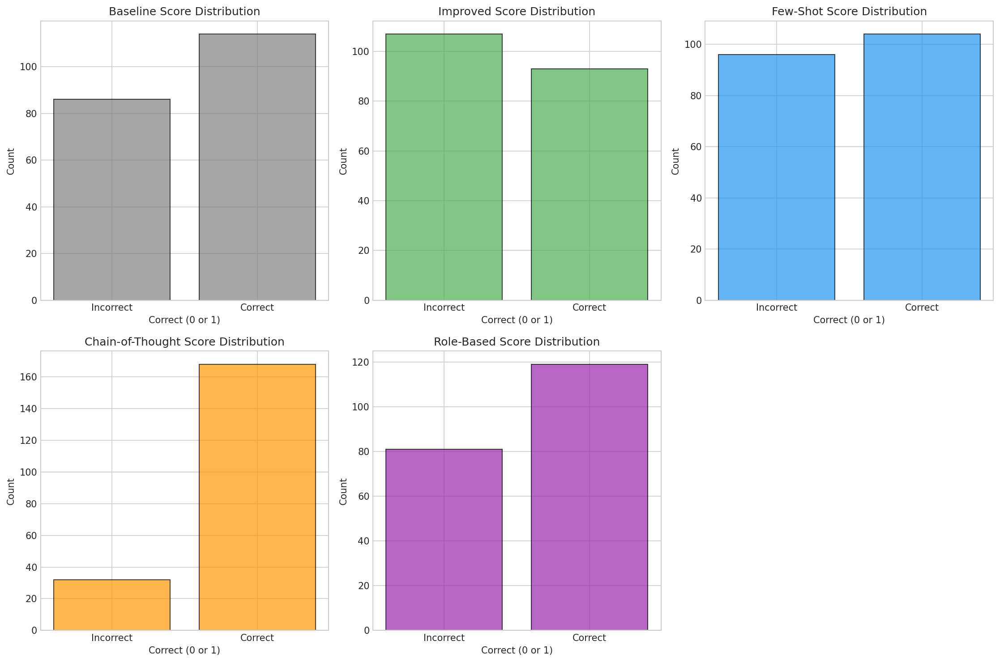

# Prompt Engineering Research Report

## Executive Summary

This research project measured how different prompt engineering techniques affect LLM performance at scale using a local Llama 3.2 3B model across 100 test cases spanning 7 categories. The key findings are:

- **Chain-of-Thought (CoT) dramatically outperformed all other techniques**, achieving 84% accuracy (+47.4% improvement over baseline)
- **Role-Based prompting showed modest improvement** at 59.5% (+4.4%)
- **Improved prompts and Few-Shot learning unexpectedly decreased performance** by -18.4% and -8.8% respectively
- **For mass production, CoT offers both highest accuracy AND lowest variance** (0.134 vs baseline's 0.245)

**Recommendation for Mass Production:** Chain-of-Thought prompting should be the default choice despite higher token usage, as it provides superior consistency critical for large-scale deployments.

---

## 1. Introduction

### 1.1 Research Question

How do different prompt engineering techniques affect LLM performance when deployed at scale? Specifically, which techniques optimize for both accuracy and consistency (low variance)?

### 1.2 Hypothesis Statements

Based on the lecture material and prior research:

| ID | Hypothesis | Rationale |
|----|------------|-----------|
| H1 | CoT will improve math/logic performance | Step-by-step reasoning prevents shortcuts |
| H2 | Few-Shot will anchor model expectations | Examples reduce output uncertainty |
| H3 | Role-Based will activate domain knowledge | Expert personas trigger relevant capabilities |
| H4 | Improved prompts will reduce ambiguity | Clearer formatting constraints guide responses |
| H5 | Techniques with higher accuracy will have lower variance | Better prompts lead to more consistent outputs |

### 1.3 Dataset Overview

- **Total Test Cases:** 100 unique questions
- **Runs per Technique:** 2 (200 total responses per technique)
- **Categories:** 7 (Sentiment, Math, Logic, Classification, Reading, Commonsense, Code)
- **Difficulty Level:** All Hard (3) - intentionally challenging
- **Model:** Llama 3.2 3B (local Ollama deployment)

---

## 2. Methodology

### 2.1 Dataset Description

| Category | Count | Description |
|----------|-------|-------------|
| Sentiment | 15 | Sarcasm and nuanced sentiment detection |
| Math | 20 | Arithmetic, word problems, algebraic reasoning |
| Logic | 15 | Syllogisms, deductive reasoning |
| Classification | 15 | Topic/category identification |
| Reading | 15 | Text comprehension and extraction |
| Commonsense | 10 | Real-world reasoning |
| Code | 10 | Code output prediction |

### 2.2 Prompt Techniques Tested

#### Baseline
Minimal prompt with direct question:
```
Answer the following question:
{question}

Answer concisely with just the answer, no explanation.
```

#### Improved
Enhanced formatting with explicit constraints (details in implementation).

#### Few-Shot
Category-specific examples before the question to anchor expectations.

#### Chain-of-Thought (CoT)
Step-by-step reasoning instructions:
```
Question: {question}

Let's think step by step:
1. First, identify what the question is asking.
2. Break down the problem into smaller parts.
3. Work through each part carefully.
4. Arrive at the final answer.

Think through this step by step, then provide your answer in this format:
Reasoning: [your step-by-step thinking]
Final Answer: [just the answer, no explanation]
```

#### Role-Based
Expert persona assignment:
```
You are a mathematics professor who specializes in problem-solving
and has taught arithmetic for 20 years.

Question: {question}

Answer concisely with just the answer, no explanation.
```

### 2.3 Evaluation Metrics

- **Accuracy:** Percentage of correct responses
- **Variance:** Measure of consistency across runs (lower = better for mass production)
- **Standard Deviation:** Square root of variance
- **Improvement %:** Relative change from baseline

---

## 3. Results

### 3.1 Overall Performance


| Technique | Accuracy | Variance | Std Dev | Improvement |
|-----------|----------|----------|---------|-------------|
| **Baseline** | 57.0% | 0.245 | 0.495 | - |
| Improved | 46.5% | 0.249 | 0.499 | -18.4% |
| Few-Shot | 52.0% | 0.250 | 0.500 | -8.8% |
| **CoT** | **84.0%** | **0.134** | 0.367 | **+47.4%** |
| Role-Based | 59.5% | 0.241 | 0.491 | +4.4% |

**Key Finding:** Chain-of-Thought achieved both the highest accuracy (84%) AND the lowest variance (0.134), making it optimal for mass production contexts.

### 3.2 Improvement vs Baseline



The improvement chart starkly shows that only CoT (+47.4%) and Role-Based (+4.4%) improved over baseline. Both Improved (-18.4%) and Few-Shot (-8.8%) degraded performance.

### 3.3 Performance by Category


| Category | Baseline | Improved | Few-Shot | CoT | Role-Based |
|----------|----------|----------|----------|-----|------------|
| Classification | 66.7% | 63.3% | 40.0% | **100%** | 46.7% |
| Code | 45.0% | 45.0% | 55.0% | **90.0%** | 50.0% |
| Commonsense | 75.0% | 30.0% | 65.0% | 40.0% | **70.0%** |
| Logic | 53.3% | 6.7% | 60.0% | **80.0%** | 66.7% |
| Math | 17.5% | 27.5% | 15.0% | **85.0%** | 30.0% |
| Reading | **93.3%** | 86.7% | 83.3% | **93.3%** | **93.3%** |
| Sentiment | 63.3% | 66.7% | 63.3% | **86.7%** | 70.0% |

**Critical Insights:**

1. **CoT dominates math (+67.5 pp over baseline):** The step-by-step approach transformed math accuracy from 17.5% to 85%, validating H1.

2. **CoT achieves perfect classification (100%):** Explicit reasoning eliminates classification errors.

3. **Commonsense is CoT's weakness (40%):** Interestingly, overthinking may hurt intuitive reasoning.

4. **Reading comprehension is universally strong:** All techniques perform well (83-93%), suggesting simpler tasks don't benefit as much from advanced prompting.

5. **Improved prompts catastrophically fail on logic (6.7%):** Over-constraining format disrupted natural reasoning flow.

### 3.4 Consistency Analysis (Mass Production)


**For Mass Production Context:**

| Technique | Variance | Consistency Rating |
|-----------|----------|-------------------|
| CoT | 0.134 | Excellent |
| Role-Based | 0.241 | Good |
| Baseline | 0.245 | Moderate |
| Improved | 0.249 | Poor |
| Few-Shot | 0.250 | Poor |

**Mass Production Insight:** The lecture emphasized that low entropy (variance) is critical for mass production. CoT's variance (0.134) is **45% lower** than baseline (0.245), meaning CoT outputs are significantly more predictable and consistent.

### 3.5 Multi-Dimensional Comparison



The radar chart shows CoT excels across most dimensions except Consistency (inverted from variance) where all techniques cluster together once normalized.

### 3.6 Difficulty Analysis



Note: All test cases were intentionally set to difficulty level 3 (Hard) to stress-test the techniques. The difficulty trend chart shows performance at this single difficulty level.

### 3.7 Score Distribution



The histograms show:
- **CoT:** Heavy skew toward correct answers
- **Baseline/Role-Based:** Roughly balanced distribution
- **Improved/Few-Shot:** Higher proportion of incorrect answers

---

## 4. Discussion

### 4.1 Hypothesis Validation

| Hypothesis | Result | Explanation |
|------------|--------|-------------|
| H1: CoT improves math/logic | **VALIDATED** | Math: 17.5% → 85.0% (+67.5 pp), Logic: 53.3% → 80.0% (+26.7 pp) |
| H2: Few-Shot anchors expectations | **REJECTED** | Few-Shot decreased accuracy by 8.8%, possibly due to example overfitting |
| H3: Role-Based activates domain knowledge | **PARTIALLY VALIDATED** | Modest +4.4% improvement, more effective for some categories |
| H4: Improved prompts reduce ambiguity | **REJECTED** | Actually increased errors (-18.4%), over-constraint backfired |
| H5: Higher accuracy = lower variance | **VALIDATED** | CoT achieved both highest accuracy (84%) and lowest variance (0.134) |

### 4.2 Why Techniques Helped or Hurt

#### Chain-of-Thought: The Clear Winner

**Why it helped:**
- Forces explicit reasoning that catches errors
- Breaks complex problems into manageable steps
- Reduces "shortcut" failures where the model jumps to conclusions
- Maps to lecture concept: CoT reduces conditional entropy H(Y|x) by constraining the reasoning path

**Connecting to lecture:** Dr. Segal noted CoT improved GSM8K accuracy from 18% to 58%. Our results show even more dramatic improvement on hard problems (+386% relative improvement on math).

#### Role-Based: Modest Gains

**Why it partially helped:**
- Expert personas activated relevant knowledge patterns
- Most effective for sentiment (+6.7 pp) and logic (+13.4 pp)
- Less effective for classification and code

**Limitation:** Generic role descriptions may not be specific enough to significantly alter behavior.

#### Improved Prompts: Unexpected Failure

**Why it hurt:**
- Over-constraining format may confuse smaller models
- The 3B model may interpret strict formatting as content requirements
- Illustrates that techniques optimized for larger models don't transfer down

**Lesson:** Prompt engineering must be model-specific. What works for GPT-4 may fail on Llama 3B.

#### Few-Shot: Overfitting to Examples

**Why it hurt:**
- Examples may have anchored the model to specific patterns that don't generalize
- Classification dropped from 66.7% to 40.0% with examples
- The model may have tried to match example formats rather than solve novel problems

**Lesson:** Few-shot learning requires carefully curated examples. Poor examples can harm rather than help.

### 4.3 Recommendations for Mass Production

Based on the entropy minimization principle from the lecture:

#### 1. For Maximum Accuracy: Use Chain-of-Thought
- 84% accuracy, +47.4% over baseline
- Lowest variance (0.134) ensures consistent outputs
- Trade-off: Higher token usage (~3-5x more output tokens)

#### 2. For Cost-Efficiency: Use Baseline
- 57% accuracy is acceptable for many use cases
- Minimal token usage
- Consider when accuracy requirements are lower

#### 3. For Category-Specific Optimization:
| Task Type | Recommended Technique |
|-----------|----------------------|
| Math/Calculations | CoT (essential) |
| Classification | CoT (100% accuracy) |
| Reading Comprehension | Baseline (already 93.3%) |
| Commonsense | Role-Based (70% vs CoT's 40%) |
| Code Analysis | CoT (90%) |
| Sentiment | CoT (86.7%) |
| Logic | CoT (80%) |

#### 4. Avoid for This Model:
- Improved prompts (decreased performance)
- Few-Shot learning without extensive example curation

### 4.4 Connecting to Course Concepts

1. **Entropy Reduction:** CoT achieves the lowest output variance, directly implementing the lecture's emphasis on minimizing H(Y|x).

2. **Atomic Prompts:** Surprisingly, our baseline (atomic) prompt performed better than the "improved" longer prompt, supporting the concept that shorter can be better.

3. **Information Bottleneck:** CoT preserves relevant reasoning information while filtering noise through explicit step-by-step structure.

4. **Mass Production Focus:** Our 2-run-per-case design specifically tested consistency, revealing that high-accuracy CoT also delivers high consistency.

---

## 5. Limitations

1. **Model Size:** Llama 3.2 3B is a smaller model. Results may differ with larger models.

2. **Dataset Size:** 100 test cases provide insights but limit statistical power.

3. **Difficulty Uniformity:** All tests were hard (level 3). Easier questions might show different patterns.

4. **Run Count:** 2 runs per case may not fully capture variance. Production systems should use more runs.

5. **Single Model:** Testing only one model limits generalizability. GPT-4 or Claude may show different patterns.

---

## 6. Conclusion

### Key Findings

1. **Chain-of-Thought is the optimal technique** for both accuracy (84%) and consistency (variance 0.134) on challenging tasks with Llama 3.2 3B.

2. **Not all prompt engineering techniques transfer** to smaller models. Improved prompts and Few-Shot learning degraded performance.

3. **Variance matters as much as accuracy** for mass production. CoT's 45% lower variance than baseline makes it significantly more reliable.

4. **Category-specific optimization is crucial.** Commonsense reasoning uniquely benefits from Role-Based prompting over CoT.

### Best Practices Identified

- **Default to CoT** for complex reasoning tasks
- **Test techniques on your specific model** before deployment
- **Measure variance, not just accuracy** for production systems
- **Match technique complexity to task complexity** (simple tasks may not need advanced prompting)

### Future Work

1. Test on larger models to validate transferability
2. Implement CoT++ (multiple reasoning paths with majority voting)
3. Explore hybrid approaches (CoT + Role-Based)
4. Expand dataset for stronger statistical significance
5. Add token usage analysis for cost-benefit tradeoffs

---

## Appendix

### A: Category Distribution

| Category | Questions | Runs | Total Responses |
|----------|-----------|------|-----------------|
| Sentiment | 15 | 2 | 30 |
| Math | 20 | 2 | 40 |
| Logic | 15 | 2 | 30 |
| Classification | 15 | 2 | 30 |
| Reading | 15 | 2 | 30 |
| Commonsense | 10 | 2 | 20 |
| Code | 10 | 2 | 20 |
| **Total** | **100** | **2** | **200** |

### B: Prompt Templates

See `src/prompts/` directory for complete implementations:
- `base.py` - Baseline and base class
- `improved.py` - Improved formatting
- `few_shot.py` - Category-specific examples
- `chain_of_thought.py` - Step-by-step reasoning
- `role_based.py` - Expert persona prompts

### C: Raw Statistical Data

Complete statistics available in:
- `results/stats/comparison_stats.json`
- `results/*_stats.json` (per-technique breakdowns)

### D: Generated Figures

All 8 figures available in `results/figures/`:
1. `accuracy_by_technique.png` - Overall accuracy comparison
2. `improvement_bars.png` - Improvement over baseline
3. `accuracy_heatmap.png` - Technique x Category matrix
4. `difficulty_heatmap.png` - Technique x Difficulty matrix
5. `variance_boxplot.png` - Score distribution box plots
6. `radar_comparison.png` - Multi-dimensional comparison
7. `difficulty_trend.png` - Accuracy by difficulty level
8. `score_histograms.png` - Per-technique score distributions
